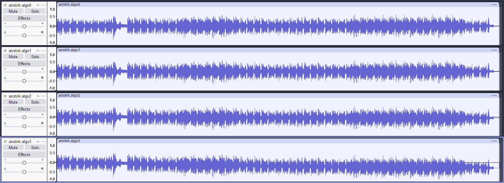
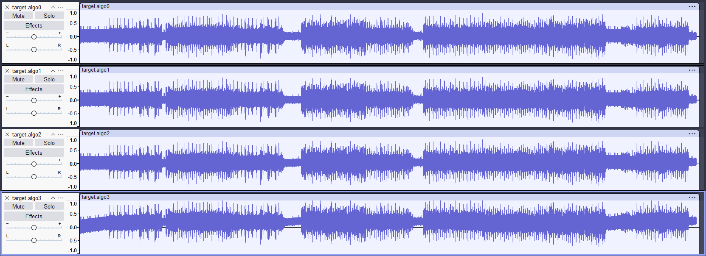
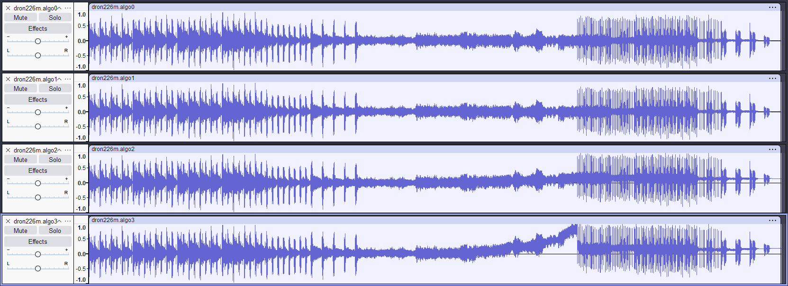
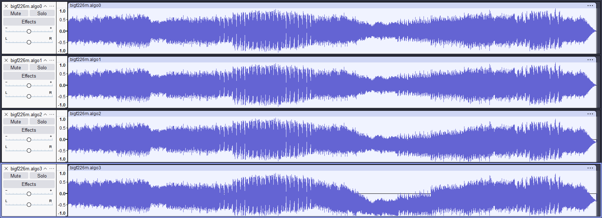
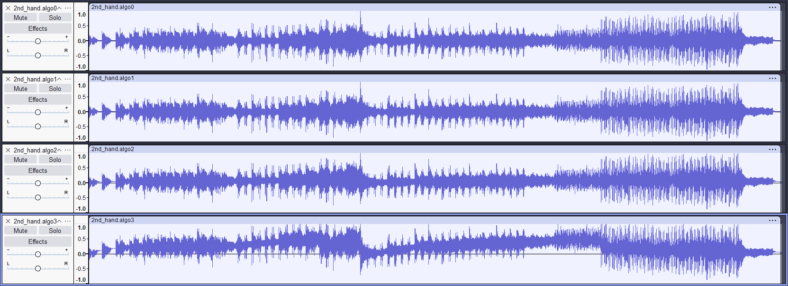
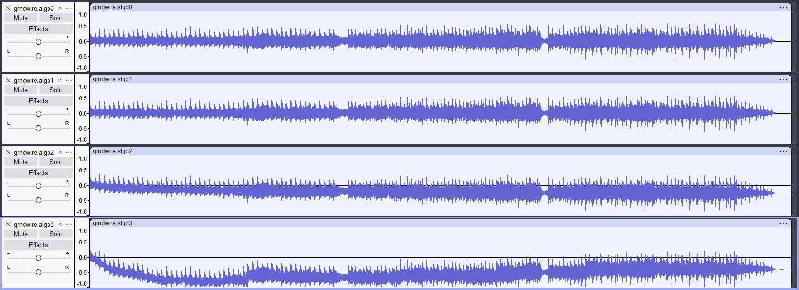
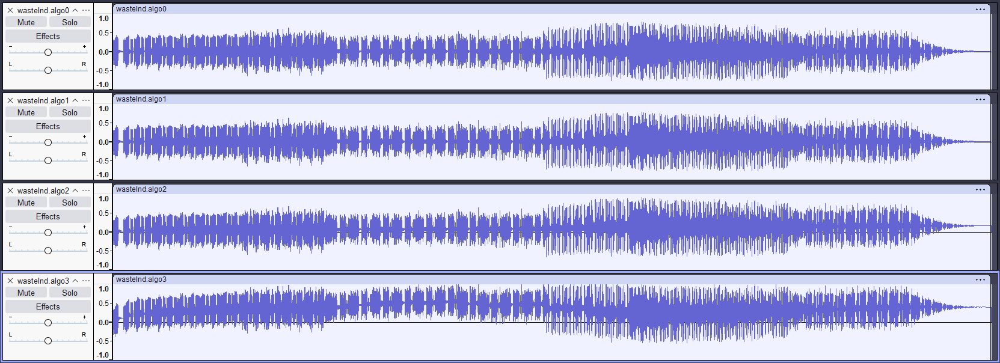

# aud2wav

This tool losslessly remuxes Westwood .AUD files into widely supported IMA ADPCM compressed .WAV files.

It can also decode .AUD into uncompressed PCM .WAV.

Only mono IMA ADPCM .AUD files are supported. Tested with music files extracted from C&C: Tiberian Dawn and Red Alert.

```
Usage: aud2wav [-o out1.wav] [-b <blocksize> | -d | -4] <input1.aud> [input2.aud ...]
        -o <filename>: specify first output filename, ignored if -4 is used
        -b <blocksize>: specify WAV ADPCM block size (including header), possible values:
                      512 - most compatible [default]
            8..2760 mod 4 - Windows ACM compatible
                 4..32771 - all possible
                       -1 - choose the smallest file out of ACM-compatible
                       -2 - choose the smallest file out of all possible
        -d: decode to PCM instead of remuxing
        -4: decode to 4 PCM files using 4 different algorithms: (implies -d)
                    algo0 - large LUT based, original Westwood [default]
                    algo1 - small LUT based
                    algo2 - small LUT based, slightly optimized
                    algo3 - small LUT based, fully optimized
```

### Example:

Convert all AUD files in the current directory to IMA ADPCM WAV files, while creating an `aud2wav.log.txt` log file:
```
aud2wav *.aud *.var *. *.v0? *.juv 2> aud2wav.log.txt
```

## Comparing ADPCM decoding algorithms

I have included several different algorithms of the IMA ADPCM decoder so that their output could be compared,
because I've found that while optimizing the original algorithm looks like a good idea at first,
it introduces small errors in the least significant bits of decoded audio samples, which accumulate over time.

IMA ADPCM WAV files consist of independently decodable blocks, at the beginning of each block the decoder is reset with a known correct decoded sample value.
Blocks are short (typically about 46 ms), and the errors only accumulate within that short block, and thus don't affect audio quality, and are left unnoticed.

AUD files, which are continuous ADPCM streams, are affected by these errors much more, and present an opportunity to demonstrate the differences in decoding algorithms.

The `-4` parameter allows comparing 4 different decoding algorithms:

0. The original Westwood algorithm, taken from the [official source code release](https://github.com/electronicarts/CnC_Remastered_Collection) of Red Alert. While the [ADPCM.CPP](https://github.com/electronicarts/CnC_Remastered_Collection/blob/master/REDALERT/ADPCM.CPP) is not used directly, it is included for reference. This algorithm uses large pre-calculated lookup tables [DTABLE.CPP](https://github.com/electronicarts/CnC_Remastered_Collection/blob/master/REDALERT/DTABLE.CPP) and [ITABLE.CPP](https://github.com/electronicarts/CnC_Remastered_Collection/blob/master/REDALERT/ITABLE.CPP) (8544 bytes total), and is the fastest.
1. Found this algorithm somewhere on the internet years ago, needs only 186 bytes of lookup tables. Its output turns out to be identical to the #0 algorithm, as well as Windows ACM (used by sndrec32.exe from Windows 95 to XP), [ADPCM-XQ](https://github.com/dbry/adpcm-xq/blob/master/adpcm-lib.c#L949), [libsndfile](https://github.com/libsndfile/libsndfile/blob/master/src/ima_adpcm.c#L306) (used by [Audacity](https://www.audacityteam.org/)), [SoX](https://github.com/chirlu/sox/blob/master/src/ima_rw.c#L110), [vgmstream](https://github.com/vgmstream/vgmstream/blob/master/src/coding/ima_decoder.c#L62), and probably many more.
2. One of my attempts to "optimize" the #1 algorithm to use less instructions. Later I've found it in [vgmstream](https://github.com/vgmstream/vgmstream/blob/master/src/coding/ima_decoder.c#L161) used in one videogame.
3. Another attempt to "optimize" the #1 algorithm. It is included in [ffmpeg](https://github.com/FFmpeg/FFmpeg/blob/master/libavcodec/adpcm.c#L419) (used by [VLC](https://www.videolan.org/), [LAVFilters](https://github.com/Nevcairiel/LAVFilters) and lots of other software), and in [vgmstream](https://github.com/vgmstream/vgmstream/blob/master/src/coding/ima_decoder.c#L117) in yet another function.

Here's the IMA ADPCM decoding function with all 4 algorithms in one, selectable by the `use_algorithm` variable:
```c
// Lookup tables for algorithms #1, #2, #3

unsigned short ADPCM_STEP_TABLE[89] = {
	7,     8,     9,     10,    11,    12,     13,    14,    16,
	17,    19,    21,    23,    25,    28,     31,    34,    37,
	41,    45,    50,    55,    60,    66,     73,    80,    88,
	97,    107,   118,   130,   143,   157,    173,   190,   209,
	230,   253,   279,   307,   337,   371,    408,   449,   494,
	544,   598,   658,   724,   796,   876,    963,   1060,  1166,
	1282,  1411,  1552,  1707,  1878,  2066,   2272,  2499,  2749,
	3024,  3327,  3660,  4026,  4428,  4871,   5358,  5894,  6484,
	7132,  7845,  8630,  9493,  10442, 11487,  12635, 13899, 15289,
	16818, 18500, 20350, 22385, 24623, 27086,  29794, 32767
};
char ADPCM_INDEX_ADJUST[8] = { -1, -1, -1, -1, 2, 4, 6, 8 };

int use_algorithm = 0;

void ADPCM_decode_sample(char *index, long *sample, unsigned char nibble) {
	
	int diff;
	
	if (use_algorithm == 0) { // Algorithm #0: original Westwood, uses large pre-calculated lookup tables
		
		int fastindex = (*index << 4) + nibble;
		diff = DiffTable[fastindex];         // DTABLE.CPP
		*index = IndexTable[fastindex] >> 4; // ITABLE.CPP

	} else {
		
		// Code common to algorithms #1, #2, #3
		
		int sign = nibble & 8;
		int delta = nibble & 7;
		
		unsigned short step = ADPCM_STEP_TABLE[*index];
		
		switch (use_algorithm) {
			case 2:  // Algorithm #2: slightly optimized, not sample-accurate, error accumulates
				diff = ((delta * step) >> 2) + (step >> 3);
				break;
			
			case 3:  // Algorithm #3: fully optimized, even worse
				diff = ((delta * 2 + 1) * step) >> 3;
				break;
			
			default: // Algorithm #1: using small lookup tables, result is identical to the original
				diff = 0;
				if (delta & 4) diff += step; step >>= 1;
				if (delta & 2) diff += step; step >>= 1;
				if (delta & 1) diff += step; step >>= 1;
				diff += step;
		}
		
		if (sign) diff = -diff;
		
		*index += ADPCM_INDEX_ADJUST[delta];
		if (*index < 0) *index = 0;
		if (*index > 88) *index = 88;
		
	} // algorithms #1, #2, #3
	
	*sample += diff;
	if (*sample > 32767) *sample = 32767;
	if (*sample < -32768) *sample = -32768;
}
```

Here are some examples of decoding AUD files with 4 different algorithms, as shown in Audacity, demonstrating the accumulation of errors:

`aud2wav -4 airstrik.aud`(from C&C: Tiberian Dawn)


`aud2wav -4 target.aud`(from C&C: Tiberian Dawn)


`aud2wav -4 dron226m.aud`(from C&C: The Covert Operations)


`aud2wav -4 bigf226m.aud`(from C&C: Red Alert)


`aud2wav -4 2nd_hand.aud`(from C&C: Red Alert - Counterstrike)


`aud2wav -4 grndwire.aud`(from C&C: Red Alert - The Aftermath)


`aud2wav -4 wastelnd.aud`(from C&C: Red Alert - The Aftermath)

